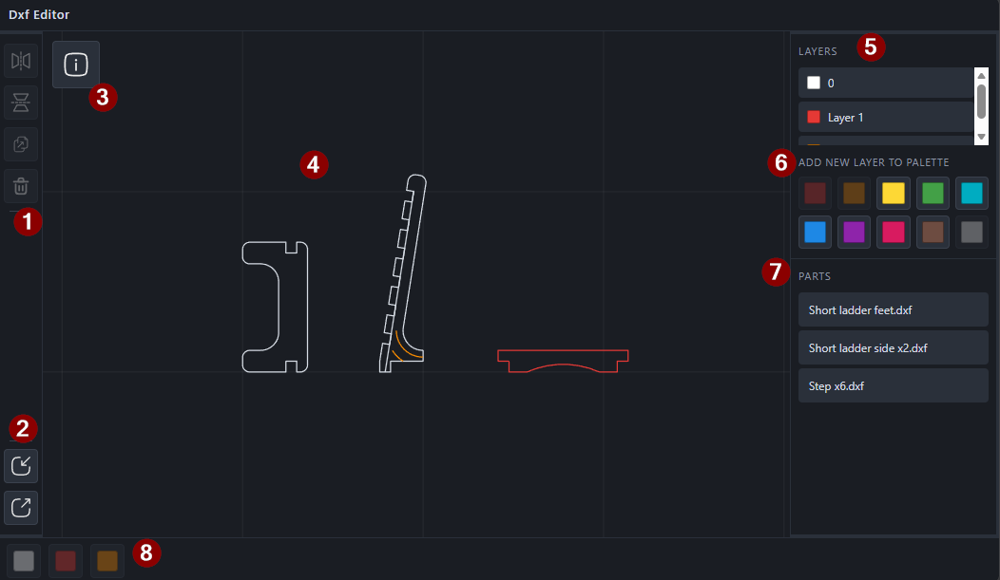
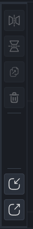
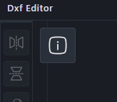
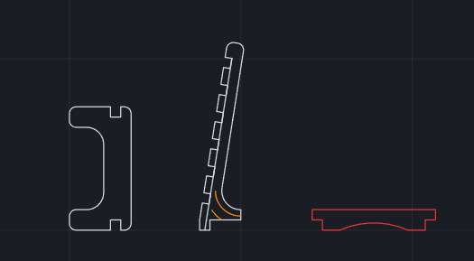
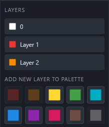
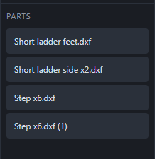
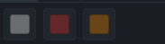

# Dxf Editor

A lightweight, client-side web utility for preparing DXF parts for LightBurn. Import multiple individual DXF part files, arrange and nest them on a canvas, assign layers/colors, then export a single master DXF.

Everything runs in the browser (Blazor WebAssembly)—uploads are processed locally; nothing is sent to a server for DXF parsing.

## Features

- Drag-and-drop or file-picker import of one or more `.dxf` files
- Pan, zoom, move, rotate, mirror, duplicate, and delete parts
- Block and entity selection (including Shift multi-select and marquee)
- Layer and color assignment for whole parts or individual entities
- Export a combined master `.dxf` (Save As when supported, otherwise download)

Planned: bounding-box / sheet size readout, and GitHub Pages hosting.

## User guide

### UI overview

The editor layout:

- **Top bar** — app title
- **Center** — canvas for parts, with an info button (top-left) that opens in-app help
- **Left rail** — transform tools, plus Import and Export at the bottom
- **Right sidebar** — Layers panel above the Parts list
- **Bottom bar** — layer color buttons for assigning the current selection



(1) Left top toolbar  
(2) Left bottom toolbar  
(3) Info button  
(4) Canvas  
(5) Layers manager panel  
(6) New layer buttons  
(7) Parts list  
(8) Layer palette bar

### Left toolbar

- **Mirror horizontally** — flips the selected part(s) left/right. Requires a selection.
- **Mirror vertically** — flips the selected part(s) up/down. Requires a selection.
- **Duplicate** — copies the selected part(s), offsets them slightly down and right, and adds uniquely named `(1)`, `(2)`, … entries to the Parts list. Ctrl+D / Cmd+D also duplicates, but places the copy at the mouse cursor.
- **Delete** — removes the selected part(s). You can also press Delete or Backspace. A confirmation prompt appears first.
- **Import** — at the bottom of the rail; opens a file picker for one or more `.dxf` files.
- **Export** — below Import; saves the current layout (all parts, entities, and layers) as a master `.dxf` via Save As when supported, otherwise a download.



### Info

This top left button opens a modal with information about the app, the features, and the controls.



### Canvas

- **Import** — drag and drop `.dxf` files onto the canvas (multiple files are fine, they will be spread out evenly across the canvas).
- **Zoom** — scroll the mouse wheel; zoom centers on the cursor.
- **Pan** — middle-mouse drag, Space+left-drag, or Alt+left-drag.
- **Select a block** — left-click a part.
- **Multi-select blocks** — Shift+click additional parts, or drag an empty area to marquee-select. Shift+marquee adds to the current selection.
- **Select entities** — hold Ctrl (or Cmd on Mac) and click to select individual lines/arcs/circles inside a block for layer and color assignment.
- **Move** — drag a selection to reposition it (click-drag on a line of the selection). The rotate handle above the selection rotates the parent block(s).
- **Duplicate** — press Ctrl+D (Cmd+D on Mac) to copy the selected block(s) with the selection’s bounding-box center at the mouse cursor.
- **Clear selection** — click empty canvas or press Escape.



### Layers (right)

The Layers panel lists every layer in the workspace (color swatch and name). Under **Add new layer to palette**, click an unused color to add that layer. Colors already in use are disabled.



### Parts list (right)

- **Click** a part name to select it on the canvas. If it is already the only selected part, click again to clear the selection.
- **Ctrl+click** (Cmd+click on Mac) toggles that part in or out of a multi-selection.
- **Shift+click** selects every part between the anchor row and the clicked row.
- The list stays in sync with what you select on the canvas.



### Layer bar (bottom)

The bottom color buttons assign the current selection to a layer. With whole blocks selected, every entity in those blocks gets the layer. With entities selected (Ctrl/Cmd+click on the canvas), only those entities are reassigned.

- The bar updates automatically when you import a DXF (source colors become layers).
- Layers you add in the Layers panel also appear here.
- Buttons are disabled when nothing is selected.



## How to run

1. Install the [.NET 10 SDK](https://dotnet.microsoft.com/download).
2. From the repo root:

   ```bash
   dotnet run --project BlazorWasmUI
   ```

3. Open the printed localhost URL in a modern browser.

Or, as soon as the app is hosted on GitHub Pages, I will provide a link to the app.

## More detail

Requirements, architecture notes, and phase status are in [SRS.md](SRS.md).
